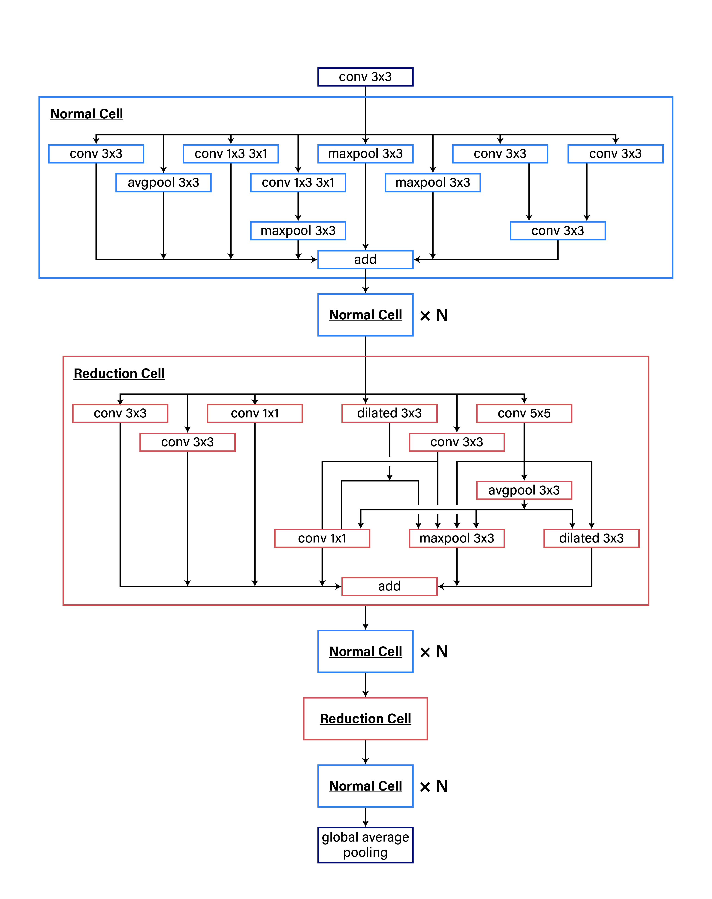
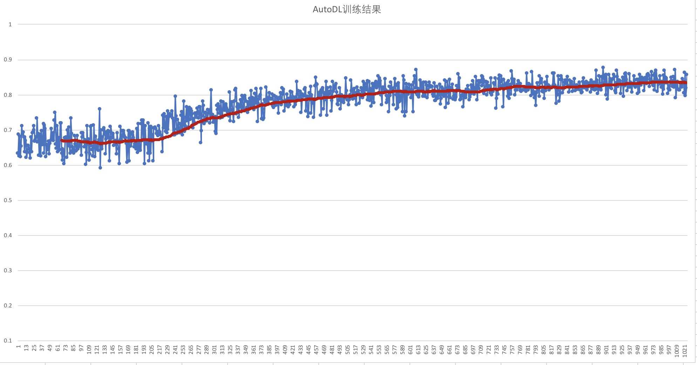

# AutoDL Design 简介

## 目录
- [安装](#安装)
- [简介](#简介)
- [数据准备](#数据准备)
- [模型训练](#模型训练)

## 安装
在当前目录下运行样例代码需要PadddlePaddle Fluid的v.1.3.0或以上的版本。如果你的运行环境中的PaddlePaddle低于此版本，请根据安装文档中的说明来更新PaddlePaddle。
* 安装Python2.7
* 训练执行依赖[PARL](https://github.com/PaddlePaddle/PARL) 框架和[absl-py](https://github.com/abseil/abseil-py/tree/master/absl) 库，通过如下命令安装
```
	pip install parl
	pip install absl-py
```


## 简介
[AutoDL](http://www.paddlepaddle.org/paddle/ModelAutoDL)是一种高效的自动搜索构建最佳网络结构的方法，通过增强学习在不断训练过程中得到定制化高质量的模型。系统由两部分组成，第一部分是网络结构的编码器，第二部分是网络结构的评测器。编码器通常以 RNN 的方式把网络结构进行编码，然后评测器把编码的结果拿去进行训练和评测，拿到包括准确率、模型大小在内的一些指标，反馈给编码器，编码器进行修改，再次编码，如此迭代。经过若干次迭代以后，最终得到一个设计好的模型。这里开源的AutoDl Design是基于PaddlePaddle框架的一种AutoDL技术实现。第二节介绍AutoDL Design的使用步骤。第三节介绍AutoDL Design的实现原理与示例。

## 数据准备
* 克隆[PaddlePaddle/AutoDL](https://github.com/PaddlePaddle/AutoDL.git)到测试机，并进入AutoDL Design路径。 
* 下载[CIFAR-10](https://www.cs.toronto.edu/~kriz/cifar-10-python.tar.gz)训练数据，并放入AutoDL Design/cifar路径下并解压，按如下命令执行`dataset_maker.py` 生成10类每类100张图片的pickle训练小数据集。
```
tar zxf cifar-10-python.tar.gz
python dataset_maker.py
```

## 模型训练
AutoDL Design在训练过程中每次通过Agent的策略网络生成用于训练的Tokens和邻接矩阵Adj，然后Trainer通过Tokens和Adj进行CNN训练网络的组建与训练，训练20个epoch以后返回训练的acc值作为Reward返回给Agent，Agent收到Reward值以后更新策略，通过不断的迭代，最终可以自动搜索到效果不错的深度神经网络。

这里提供了如下两种测试的方法。

### 针对生成tokens个数的收敛性测试
由于CNN训练每次执行时间长，为了测试整体Agent框架的正确性，这里我们把生成tokens个数作为模拟CNN训练的返回Reward，最终自动搜索出来的网络可以使得tokens的个数越来越多。这里tokens向量总长度设置的是20。执行以下命令：
```
	export FLAGS_fraction_of_gpu_memory_to_use=0.98
	export FLAGS_eager_delete_tensor_gb=0.0
	export FLAGS_fast_eager_deletion_mode=1
	CUDA_VISIBLE_DEVICES=0 python -u simple_main.py
```
预期结果：
日志中 `average rewards`逐步向20收敛递增

```
Simple run target is 20
mid=0, average rewards=2.500
...
mid=450, average rewards=17.100
mid=460, average rewards=17.000

```

### AutoDL网络自动搜索训练
基于CIFAR-10小数据集上执行自动网络搜索策略，每次先执行Agent策略网络生成新的策略，然后Trainer根据生成的策略去进行模型的训练与Reward(即acc指标)结果的反馈，最终不断迭代搜索到准确率更高的模型网络结构。执行以下命令：
```
	export FLAGS_fraction_of_gpu_memory_to_use=0.98
	export FLAGS_eager_delete_tensor_gb=0.0
	export FLAGS_fast_eager_deletion_mode=1
	CUDA_VISIBLE_DEVICES=0 python -u main.py
```
预期结果：
日志中 `average accuracy`逐步增大

```
step = 0, average accuracy = 0.633
step = 1, average accuracy = 0.688
step = 2, average accuracy = 0.626
step = 3, average accuracy = 0.682
......
step = 842, average accuracy = 0.823
step = 843, average accuracy = 0.825
step = 844, average accuracy = 0.808
......
```
### 结果展示


横坐标是迭代的step轮数，纵坐标是模型训练的acc指标，通过图中所示，通过不断的迭代搜索，使得自动构建模型的效果在不断增强。
